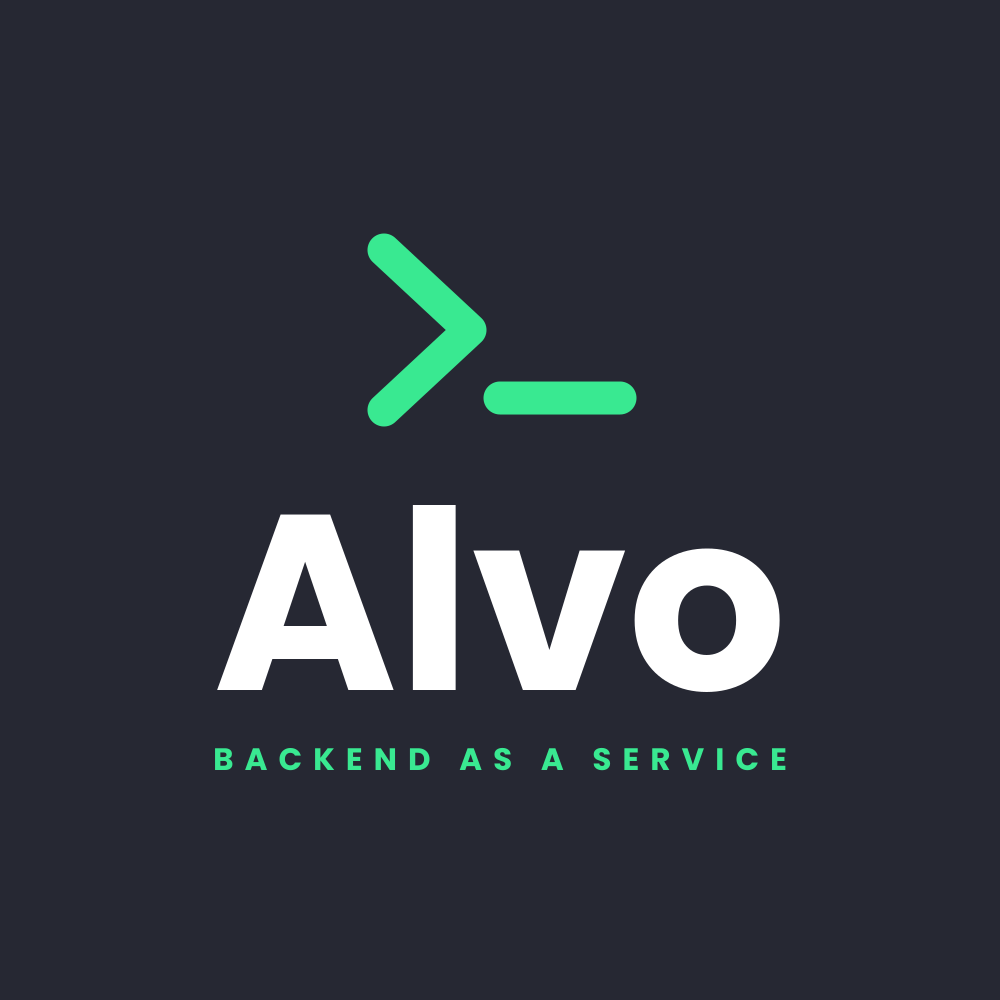
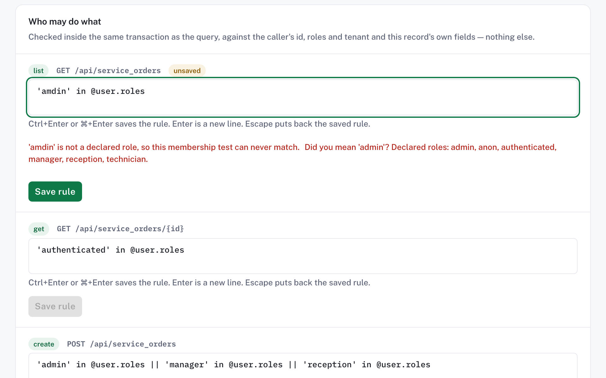
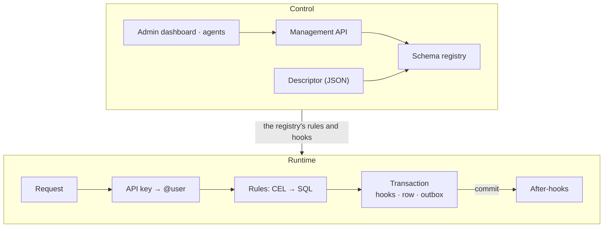

<p align="center"></p>

<h1 align="center">Alvo</h1>

<p align="center"><strong>Describe your backend in one JSON file. Get a secure, production-shaped API — standalone in Docker or embedded in your ASP.NET Core app.</strong></p>

<p align="center">
  <a href="https://github.com/Burgyn/MMLib.Alvo/actions/workflows/ci.yml"></a>
  <a href="LICENSE"></a>
  <a href="https://dotnet.microsoft.com/download/dotnet/10.0"></a>
  <a href="https://burgyn.github.io/MMLib.Alvo/"></a>
  <a href="https://burgyn.github.io/MMLib.Alvo/project/roadmap/"></a>
</p>

<p align="center">
  <a href="https://burgyn.github.io/MMLib.Alvo/">Documentation</a> ·
  <a href="#quick-start">Quick start</a> ·
  <a href="https://burgyn.github.io/MMLib.Alvo/start-here/tutorial/">Tutorial</a> ·
  <a href="https://burgyn.github.io/MMLib.Alvo/reference/">Reference</a>
</p>

Alvo is a .NET-native backend-as-a-service: one validated JSON descriptor — entities, access rules, hooks, computed
fields and rollups — becomes a REST API with its own OpenAPI document. It is built for developers who work with coding
agents, and for .NET teams that want a configurable backend inside their own app. Access rules are compiled into the
SQL that reads the rows, the whole backend is one file an agent can validate and dry-run, and every refusal is an
RFC 9457 problem document: an invalid descriptor or record names the pointer and, where it can, suggests a fix.

## See it

The `tickets` entity of [`examples/help-desk`](examples/help-desk/help-desk.alvo.json): anyone authenticated may read,
agents and admins may create, only an admin may delete, and two before-hooks trim the title and refuse a high-priority
ticket without a body.

[//]: # (excerpt: examples/help-desk/help-desk.alvo.json#/entities/tickets)
```json
{
  "audit": true,
  "fields": {
    "title": { "type": "string", "required": true, "maxLength": 120 },
    "body": { "type": "text" },
    "priority": { "type": "enum", "values": ["low", "normal", "high"], "default": "normal" },
    "status": { "type": "enum", "values": ["open", "closed"], "default": "open" },
    "estimate_hours": { "type": "decimal", "precision": 5, "scale": 1 },
    "hourly_rate": { "type": "decimal", "precision": 6, "scale": 2 },
    "estimate_cost": { "type": "decimal", "precision": 12, "scale": 2, "computed": "estimate_hours * hourly_rate" }
  },
  "rules": {
    "list": "'authenticated' in @user.roles",
    "get": "'authenticated' in @user.roles",
    "create": "'agent' in @user.roles || 'admin' in @user.roles",
    "update": "'agent' in @user.roles || 'admin' in @user.roles",
    "delete": "'admin' in @user.roles"
  },
  "hooks": {
    "beforeCreate": [
      { "action": { "mutate": { "title": { "$cel": "trim(new.title)" } } } },
      {
        "condition": "new.priority == 'high' && !has(new.body)",
        "action": { "reject": "A high-priority ticket needs a body." }
      }
    ]
  }
}
```

An agent creates a ticket, then a high-priority one without a body. Both exchanges were captured from a real host:

[//]: # (exchange: readme/see-it)
```http
POST /api/tickets HTTP/1.1
X-Alvo-Api-Key: agent.$ALVO_AGENT_KEY_SECRET
Content-Type: application/json

{
  "title": "  Printer on fire  ",
  "body": "Third floor."
}

HTTP/1.1 201 Created
Content-Type: application/json; charset=utf-8
ETag: "639272046278281070"
Location: /api/tickets/02ccad87-0d94-48b5-8ce2-e7c845bfb9d6

{
  "id": "02ccad87-0d94-48b5-8ce2-e7c845bfb9d6",
  "body": "Third floor.",
  "created_at": "2026-10-10T04:50:27.828107+00:00",
  "created_by": "3f2b8c1e-7a4d-4e9b-9c21-5d6e7f8a9b01",
  "estimate_cost": null,
  "estimate_hours": null,
  "hourly_rate": null,
  "priority": "normal",
  "status": "open",
  "title": "Printer on fire",
  "updated_at": "2026-10-10T04:50:27.828107+00:00",
  "updated_by": "3f2b8c1e-7a4d-4e9b-9c21-5d6e7f8a9b01"
}

POST /api/tickets HTTP/1.1
X-Alvo-Api-Key: agent.$ALVO_AGENT_KEY_SECRET
Content-Type: application/json

{
  "title": "Server room is flooding",
  "priority": "high"
}

HTTP/1.1 403 Forbidden
Content-Type: application/problem+json

{
  "type": "https://alvo.dev/errors/forbidden",
  "title": "Forbidden",
  "status": 403,
  "detail": "A high-priority ticket needs a body. (refused by the before-hook at '/entities/tickets/hooks/beforeCreate/1')"
}
```

The title came back trimmed and `priority` defaulted to `normal`; the refusal's `detail` carries the hook's own message
and names the hook that refused.

## Quick start

No clone needed: you need Docker with Compose v2, `curl` and `openssl`. One compose file runs the published image,
`ghcr.io/burgyn/alvo` (`linux/amd64` and `linux/arm64`), over PostgreSQL, serving the
[`vehicle-registry`](examples/vehicle-registry/vehicles.alvo.json) example the image carries. The first run pulls the
Alvo and PostgreSQL images; later runs start in seconds.

```bash
curl -fsSLO https://raw.githubusercontent.com/Burgyn/MMLib.Alvo/main/docker-compose.quickstart.yml
export ALVO_DEMO_KEY_SECRET="$(openssl rand -hex 16)"
export ALVO_ADMIN_PASSWORD="$(openssl rand -hex 12)"
docker compose -f docker-compose.quickstart.yml up --wait --wait-timeout 90
curl -sS localhost:8080/api/owners -H "X-Alvo-Api-Key: demo.$ALVO_DEMO_KEY_SECRET" \
  -H "Content-Type: application/json" -d '{"name":"Ada Lovelace"}'
curl -sS localhost:8080/api/owners -H "X-Alvo-Api-Key: demo.$ALVO_DEMO_KEY_SECRET"
```

The API browser is at `http://localhost:8080/scalar`, and the dashboard at `http://localhost:8080/admin`, signed in as
`admin@alvo.local` with `$ALVO_ADMIN_PASSWORD`. `ALVO_DESCRIPTOR` switches to another example inside the image or to
your own file; the compose file's header lists what to change. `edge` follows `main`; `ALVO_IMAGE` pins another tag.
Keep the variables exported for the session; tear down with
`docker compose -f docker-compose.quickstart.yml down --volumes`. To build the image from source instead, see
[Running in production](https://burgyn.github.io/MMLib.Alvo/guides/production/#1-get-the-image).

Next: [the 10-minute tutorial →](https://burgyn.github.io/MMLib.Alvo/start-here/tutorial/) · [run your own descriptor](https://burgyn.github.io/MMLib.Alvo/start-here/run-your-own/)

## What you get

- **[One validated descriptor](https://burgyn.github.io/MMLib.Alvo/concepts/descriptor/)** — entities, fields, rules, hooks, computed fields and rollups, checked by a JSON Schema and then semantically.
- **[Rules in SQL](https://burgyn.github.io/MMLib.Alvo/guides/access-rules/)** — CEL access rules compiled into the SQL of every list, read, update and delete (a create's row is checked in the transaction); an operation with no rule is refused.
- **[Hooks that fail closed](https://burgyn.github.io/MMLib.Alvo/guides/before-hooks/)** — before-hooks refuse or rewrite a write inside its transaction, with built-in functions and your own C# ones.
- **[Events and webhooks](https://burgyn.github.io/MMLib.Alvo/guides/after-hooks-and-webhooks/)** — every write commits its event through an outbox; after-hooks send e-mail and deliver webhooks, with retries.
- **[Audit](https://burgyn.github.io/MMLib.Alvo/guides/audit-row-changes/) and [history](https://burgyn.github.io/MMLib.Alvo/guides/apply-and-evolve/)** — audit columns per entity, and every applied descriptor kept as a revision you can roll back to.
- **[Agent-first](https://burgyn.github.io/MMLib.Alvo/start-here/coding-agents/)** — problem documents with a pointer and a fix suggestion for invalid input, dry runs, `Idempotency-Key`, and `llms.txt`.
- **[Admin dashboard](https://burgyn.github.io/MMLib.Alvo/guides/admin-dashboard/)** — schema, rule and hook editors, a data browser, history and rollback, and a schema assistant.
- **[Standalone or embedded](https://burgyn.github.io/MMLib.Alvo/concepts/modes/)** — the published Docker image, or a library in your ASP.NET Core host, on SQLite or PostgreSQL.

<picture>
  <source media="(prefers-color-scheme: dark)" srcset="assets/screenshots/rules-editor-dark-2x.png">
  
</picture>

## How it fits together



A descriptor reaches the schema registry from a file at boot or through the Management API, which the dashboard and
agents share. Every request then takes the runtime path: a read's rule is part of the SQL that reads, a write's
before-hooks, row and outbox event share one transaction, and the after-hooks run after the commit.
[Architecture](https://burgyn.github.io/MMLib.Alvo/concepts/architecture/) has the details.

## Packages

Nothing is on NuGet yet. Until v0.1, reference the projects from a clone, or pack them to a local feed —
[Embed in ASP.NET Core](https://burgyn.github.io/MMLib.Alvo/start-here/embed/) shows both.

| Package | Description |
| --- | --- |
| `MMLib.Alvo.Abstractions` | The interface-first root of the Alvo dependency graph: every port, and nothing that implements one. |
| `MMLib.Alvo` | The Alvo core: schema registry, Data API, rule engine, events and management, registered with AddAlvo. |
| `MMLib.Alvo.Data.EntityFrameworkCore` | The relational adapter every Alvo engine driver is built on. |
| `MMLib.Alvo.Data.Sqlite` | The SQLite driver for Alvo, registered with UseSqlite. |
| `MMLib.Alvo.Data.PostgreSql` | The PostgreSQL driver for Alvo, registered with UsePostgreSql. |
| `MMLib.Alvo.Identity` | ASP.NET Core Identity for Alvo: administrator accounts, roles, cookie sign-in and the bootstrap administrator. |
| `MMLib.Alvo.Admin` | The Alvo admin dashboard: server-interactive Blazor components and the design system they ship with. |
| `MMLib.Alvo.Ai` | The Alvo schema assistant: an agent that reads a project and proposes a descriptor change, and cannot apply one. |

The standalone host, `MMLib.Alvo.Host`, is not a package: it ships as the `ghcr.io/burgyn/alvo` container image, published
from `main` as `edge` until the first release tag.

## Status and roadmap

Alvo is **pre-v0.1**. Everything above runs today and is tested on every change, but the descriptor format
and the APIs may still change before the first tagged release. Some declared blocks parse without running yet, and
dynamic entities — record types your end users define at runtime — are planned, not shipped.
[What works today](https://burgyn.github.io/MMLib.Alvo/start-here/what-works-today/) says exactly what runs;
[Roadmap and status](https://burgyn.github.io/MMLib.Alvo/project/roadmap/) and [`docs/PLAN.md`](docs/PLAN.md) say what
comes next.

## Contributing

See [`CONTRIBUTING.md`](CONTRIBUTING.md) for the build and test workflow, the coding conventions and the pull-request
process, including the CLA.

## License

[Apache-2.0](LICENSE). The core is and will remain free and open source under Apache-2.0. Only enterprise add-ons and
optional hosting may be commercial, as separate `Alvo.Enterprise.*` packages; later commercialisation means adding
add-ons, never relicensing the core.

Docs: https://burgyn.github.io/MMLib.Alvo/ · For agents: https://burgyn.github.io/MMLib.Alvo/llms.txt
