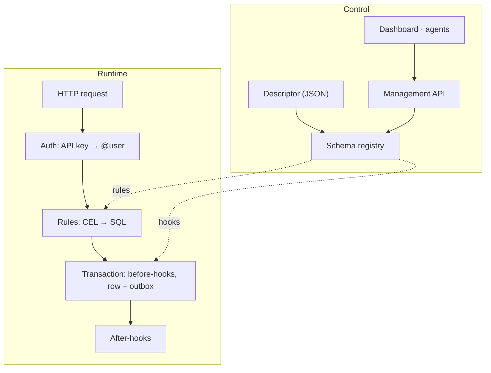

Alvo has two paths. The **control path** changes what the backend is: a descriptor is checked, the database is migrated
and the rules are compiled. The **runtime path** serves requests against what the control path produced. Both run in
one process, in the standalone image and in your own ASP.NET Core host alike.

## The control path

A descriptor arrives from a file at boot, from the [Management API](/MMLib.Alvo/reference/management-api/), or from the
dashboard, which calls the same API in process. Every door leads to the same steps:

1. **Validate.** The JSON Schema, then the semantic checks, then every CEL expression compiled in its profile against
   its entity ([The project descriptor](/MMLib.Alvo/concepts/descriptor/#how-a-descriptor-is-checked)).
2. **Plan.** The new schema is compared with the one applied last, recorded in the database, not re-read from live
   tables. A plan that would discard data stops here unless the apply allows it.
3. **Apply and record.** The schema change and the new revision in the descriptor history are written as one unit, so a
   lost race cannot leave the schema changed and the change unrecorded.
4. **Prime.** The rules, hooks and role catalog are compiled from the accepted descriptor into the policy catalog every
   request reads.

The generated routes are built from the applied schema when the first request arrives, and then kept. A change to rules
or hooks applied at runtime takes effect on the next request. A change to the **shape** applied at runtime does not
reach the Data API until the process restarts: an entity added through the Management API or the dashboard gets no route
([#103](https://github.com/Burgyn/MMLib.Alvo/issues/103)), and a field added to an existing entity is refused as
`unknown-field` until then ([#353](https://github.com/Burgyn/MMLib.Alvo/issues/353)).

## The runtime path

Every generated route is a minimal-API endpoint, and every one takes the same steps:

- **Authenticate.** The API key header resolves to a caller: a user id, roles and at most one tenant. No key means the
  anonymous caller, judged by the same rules. An unusable key is a `401`.
- **Scope.** The key's scopes must cover the entity and the operation, or the answer is `403 out-of-scope`.
- **Decide.** The policy engine resolves the operation's rule, the tenant scope and the field masks into a decision,
  or refuses it with `403 forbidden`.
- **Read** in one SQL statement whose `WHERE` holds the rule, the tenant scope, then the caller's filter and the page
  boundary, each `AND`-ed on and parenthesised.
- **Write** in one transaction: the before-hooks run over the row locked for the write, the rule's `WITH CHECK` judges
  the row as it will be stored, then the row and its event are written together and committed.
- **After the commit**, a background dispatcher delivers the event to the after-hooks.

Your own endpoints in an embedded host enter at **Decide**: they call `IAlvoData` with the caller's context, and the
same decision is made inside the port. [Security model](/MMLib.Alvo/concepts/security-model/) says what each step
guarantees.

## Ports and the provider model

The core never references a concrete database, mail server or identity provider. It talks to **ports**, interfaces in
`MMLib.Alvo.Abstractions`, and a provider package plugs an implementation in with an extension method on the one entry
point, `AddAlvo(alvo => alvo.UsePostgreSql(…))`. A new provider is a new package, never an edit to the core.

| Port | What it does |
|---|---|
| `IAlvoData` | reads and writes rows, with the caller's context; the policy is enforced inside it, not around it |
| `IPolicyEngine` | turns rules, the tenant scope and field masks into a decision; default-deny throughout |
| `ISchemaRegistry` | supplies the entity model everything above it works from |
| `ISchemaMigrator` | plans and applies a schema change |
| `IAppliedSchemaStore` | keeps the schema applied last, the "current" side of every plan |
| `IDescriptorVersionStore` | keeps the append-only descriptor history, the rollback targets |
| `IDescriptorSource` | loads the descriptor, from a file today |
| `IFieldSqlRenderer` | a database dialect's half of rendering a rule: identifiers, literals, the null fold |
| `IOutboxStore` | the event queue: append inside the write, claim, mark delivered |
| `IAlvoContextResolver` | turns a presented credential into a caller |
| `ISecretStore` | the values a descriptor may only name, such as an API key for the AI connection |
| `IEmailSender` | where an `email` after-hook delivers |
| `IAlvoManagement` | every Management API operation, which the dashboard and the schema assistant call in process |

The two database providers share one EF Core-based implementation and differ in their dialect. SQL generation for a
rule is split the same way: the structure (`AND`, `OR`, `NOT`) is the core's, and everything a database spells
differently goes through `IFieldSqlRenderer`. That split is what keeps rules, events and tenancy identical on SQLite
and PostgreSQL, and it is where the planned [dynamic entities](/MMLib.Alvo/concepts/dynamic-entities/) will plug in a
renderer for a field stored as JSON.

## Events and the outbox

Every write records an event in the same transaction as the row, in an outbox table: no change without an event, and
no event without a change. An event takes five stages:

| Stage | What happens |
|---|---|
| **emit** | inside the write's transaction, on the same connection, one row is appended to the outbox |
| **claim** | a dispatcher takes the oldest undelivered entries with one statement and counts the attempt |
| **deliver** | the after-hooks subscribed to the event run their `webhook` or `email` action |
| **mark** | the entry is stamped as delivered, only after every matched hook ran |
| **retire** | the entry stays: nothing deletes it, so an abandoned event remains countable |

A delivery that fails releases the entry for another attempt, up to a ceiling, after which it is left alone and still
observable. A process killed mid-delivery repeats the action after a restart. That makes delivery **at-least-once**, so
every receiver must be idempotent: the event's `id` is the one value stable across redeliveries, and the key to
deduplicate on. The envelope is CloudEvents 1.0.

There is no global order. Events for one row are delivered in order only while a single dispatcher runs **and** no two
events for that row are written within the same millisecond by different processes; a second instance delivering
events breaks the order silently, so run one ([Running in production](/MMLib.Alvo/guides/production/#run-more-than-one-instance)).
[After-hooks, events and webhooks](/MMLib.Alvo/guides/after-hooks-and-webhooks/) shows what a receiver gets.

## Packages

A package is earned, not assumed: code becomes its own package only when it pulls a heavy dependency most users do not
want, is a real swap point, or ships differently. Everything else is a feature folder inside the core, organized by
feature rather than by technical layer.

| Package | Holds |
|---|---|
| [`MMLib.Alvo.Abstractions`](/MMLib.Alvo/reference/csharp/mmlib-alvo-abstractions/) | the ports and the schema model; the root every other package depends on |
| [`MMLib.Alvo`](/MMLib.Alvo/reference/csharp/mmlib-alvo/) | the core: descriptor, migrations, rule engine and CEL, events, the generated Data API and the Management API |
| [`MMLib.Alvo.Data.EntityFrameworkCore`](/MMLib.Alvo/reference/csharp/mmlib-alvo-data-entityframeworkcore/) | the shared EF Core implementation of the data ports |
| [`MMLib.Alvo.Data.Sqlite`](/MMLib.Alvo/reference/csharp/mmlib-alvo-data-sqlite/), [`MMLib.Alvo.Data.PostgreSql`](/MMLib.Alvo/reference/csharp/mmlib-alvo-data-postgresql/) | the two database providers |
| [`MMLib.Alvo.Identity`](/MMLib.Alvo/reference/csharp/mmlib-alvo-identity/) | the people who sign in to the dashboard, and the bootstrap administrator |
| [`MMLib.Alvo.Admin`](/MMLib.Alvo/reference/csharp/mmlib-alvo-admin/) | the admin dashboard, which reaches the core only through the Management API's port |
| [`MMLib.Alvo.Ai`](/MMLib.Alvo/reference/csharp/mmlib-alvo-ai/) | the schema assistant, which also sees only the ports |

The standalone host is not a package: it is the container image, composed from these with both database drivers and
an API browser. Architecture tests keep the boundaries, for example that the dashboard holds no reference to the core.

## Put it to work

- [Standalone and embedded](/MMLib.Alvo/concepts/modes/): the two ways to run the same engine.
- [Embed in ASP.NET Core](/MMLib.Alvo/start-here/embed/): compose the packages in your own host.
- [Call Alvo from your endpoints](/MMLib.Alvo/guides/call-from-endpoints/): use `IAlvoData` directly.
- [C# API](/MMLib.Alvo/reference/csharp/): every public type.
- Design notes: [package boundary](https://github.com/Burgyn/MMLib.Alvo/blob/main/docs/architecture/package-boundary.md),
  [event backbone](https://github.com/Burgyn/MMLib.Alvo/blob/main/docs/architecture/events.md),
  [extensibility](https://github.com/Burgyn/MMLib.Alvo/blob/main/docs/architecture/extensibility.md).
