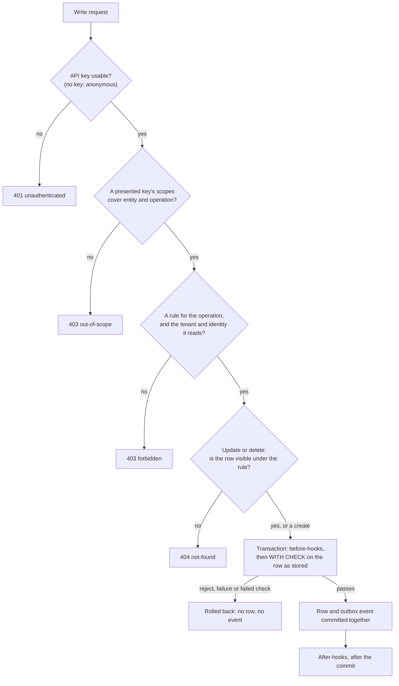

Alvo's security rests on one premise: **the only way to the data is through Alvo**. Every request, from the generated
API, the dashboard or your own C# endpoints, reaches the database through one data port that applies the descriptor's
rules inside the query itself. This page states what that buys, what it does not, and who can change what.

## In short

What Alvo guarantees, for every access that goes through it:

- **Nothing is reachable by default.** An operation without a rule is refused, and the Management API admits nobody
  but the bootstrap administrator until the descriptor grants a level.
- **Rules are enforced inside the data layer.** A read's rule is compiled into the `WHERE` clause of the one statement
  that reads, with every caller value bound as a parameter. A write's check on the row being stored is evaluated in
  memory, inside the write's transaction. No filter or page size can loosen either, and an endpoint of your own that
  calls Alvo's data port is judged by the same rules for the caller it passes.
- **A write either satisfies every check or does not happen.** Before-hooks run inside the write's transaction; a
  refusal or a failure rolls the whole write back, event included.
- **Nothing the descriptor can express reaches the network inside a write's transaction**, by construction rather than
  by convention. The one exception is a function a host developer registers in C#, which is host code.
- **Policy refusals disclose kinds, not data.** A refused read or write says what kind of refusal it is; a row a rule
  hides answers the same as a row that does not exist, except that a constraint conflict can reveal it (below).
- **Every request is bounded**: page size, body size and depth, filter depth and width, batch rows. The values are in
  [Limits and budgets](/reference/limits/).

Where the guarantees stop:

- **Out-of-band access bypasses all of it.** A direct SQL connection, another service writing to the same database, or
  a restored dump is not judged by any rule and emits no event, so no after-hook runs and nothing records the change.
  Treat the database credentials as the keys to everything.
- **Host code is trusted.** A C# function or endpoint a host developer adds runs with the host's power, not within the
  descriptor's grammar. Who the caller of a custom endpoint is, and any database access that does not go through Alvo's
  data port, is the host's responsibility.
- **A constraint conflict (`409`) can reveal rows a rule hides**, because the database enforces a constraint over every
  row, not over the rows a caller may see:
  - a `PUT` create-or-replace on an id held by a row the caller's rule hides, or by another tenant's row, answers
    `409`, because the primary key is the id alone and cannot collide silently; the caller must already hold that
    UUID to ask;
  - a value a `unique` field already holds answers `409`, and that row may be one the caller cannot see: uniqueness is
    instance-wide on an entity that is not tenant-scoped, and tenant-wide on a scoped one;
  - a delete refused because a `ref` with `onDelete: restrict` still points at the row answers `409 conflict`
    with violation code `referenced`: it tells the caller that some record references it, which the caller may not be
    allowed to read.

  Do not make a guessable value, such as an e-mail address, `unique` if its existence is confidential.
- **The schema's shape is public.** Which entities exist and their non-hidden fields are published by the routes and
  the OpenAPI document. Data and the names of hidden fields are not.

## Default-deny

Every layer starts closed and opens only on an explicit declaration:

- **An entity operation with no rule** is refused for everyone with `403 forbidden`. A missing rule never means "no
  restriction".
- **An anonymous caller** is judged by the same rules as anyone else: it is served only where a rule admits it, for
  example one that tests the built-in `anon` role. A rule that reads `@user.id` refuses a caller with no identity
  rather than comparing against an empty one.
- **A tenant-scoped entity** refuses a caller who has no tenant before any rule is consulted.
- **The Management API** answers every route with `403` except to the bootstrap administrator, until the descriptor's
  `access` block maps roles to a level.
- **The image ships no credential**: no API key and no administrator password. A host with none configured still
  starts, and refuses every operation no rule opens to the anonymous caller.
- **An unknown construct in an expression** compiles nowhere, and a refused descriptor feature is refused at apply
  rather than accepted and ignored.

## Who can change what

Three parties shape a running backend, and each can do only what its channel allows.

| Party | Changes it through | Can | Cannot |
|---|---|---|---|
| **Descriptor author**: a developer, an agent, a dashboard user with the `developer` level | the descriptor: a file, the Management API, the dashboard | declare entities, rules, hooks, derived values and who may manage the project | express a loop, a network call or file access; reach past the [CEL profiles](/concepts/cel/); grant itself `admin`: a change to `access` needs the `admin` level |
| **Host developer** (embedded mode) | C# in the host application | register CEL functions with `AddCelFunction`, add endpoints that call Alvo's data port, decide who the caller is for those endpoints, attach middleware to the generated routes | change what the descriptor's rules decide: an endpoint calling `IAlvoData` is judged by the same rules, for the caller it passes. Choosing that caller correctly, and any direct database access, is the host's responsibility |
| **API caller** | an HTTP request with an API key | what the descriptor's rules allow for the key's user, roles and tenant, narrowed further by the key's scopes | see or change rows a rule excludes, write a framework-managed column, choose a tenant the key was not issued for |

Two more sit outside the descriptor on purpose. **The operator** sets infrastructure: connection strings, API keys,
the bootstrap administrator, the AI connection. Credentials never enter the descriptor, so a descriptor can be shared
and reviewed without leaking one. **The bootstrap administrator** always holds the `admin` level, because a project
that locked everyone out of its own `access` block would otherwise be unrecoverable.

The two **escape hatches** are both the host developer's: a [custom CEL function](/guides/custom-cel-functions/)
and a [custom endpoint](/guides/call-from-endpoints/). They let you outgrow the descriptor without leaving the
runtime, and they are as trustworthy as the code you write in them. A host function is not bounded by CEL's grammar:
it runs inside the write's transaction with no time budget, can loop or block, and Alvo's tenant filter does not reach
inside it, so a function that reads stored data must filter by the tenant itself. That is why only a host developer can
add one.

An API key's scopes narrow what it reaches on the Data API only. On the Management API a key reaches whatever its
**roles** reach, so narrow a key's management reach by narrowing its roles.

## Rules in the data layer

Every write to the generated API passes the same gates, in this order:

A rule is CEL compiled when the descriptor is applied. Alvo borrows PostgreSQL's row-level security model for the
shape:

- `list`, `get` and `delete` rules are **row filters** (`USING`): a row the rule excludes is not in the page, and a
  single row it excludes answers `404`, exactly like a row that does not exist.
- `create` rules are **checks on the row being written** (`WITH CHECK`): a row that fails is refused with `403`.
- `update` rules are both, from one compiled rule: you can only change a row the rule lets you see, and the row as
  changed must still satisfy it.

A row filter is rendered into SQL. A check on the row being written has no stored row to filter, so it is evaluated in
memory over the candidate row, inside the write's transaction; a test proves the two evaluators agree on every
expression they can both evaluate.

Every read is one statement whose `WHERE` holds the rule's predicate and the tenant scope first; the caller's filter and
the page boundary are only ever added with `AND`, fully parenthesised, so no caller input can loosen the policy term.
Values come in as bind parameters, never as SQL text. After a before-hook changes a row, the `WITH CHECK` runs again on
the changed row, so a hook cannot place a row where the caller could not.

The policy sits inside `IAlvoData`, the data port, not in front of it. Your own endpoints call the same port with the
caller's context, and get the same answer the generated API gives. [Access rules](/guides/access-rules/)
shows the rules at work, and [CEL in Alvo](/concepts/cel/#how-a-rule-becomes-sql) the SQL they become.

Rules also stand on applied facts rather than hopes: a role name a rule tests that `auth.roles` does not declare is
refused at apply, because a misspelled role would silently admit nobody, or, negated, everybody.

## Hooks fail closed, and stay off the network

A before-hook runs inside the transaction of the write it judges, over the row locked for that write:

- A `reject` that fires refuses the write with `403 forbidden` and the author's own message. Nothing is written and no
  event is recorded.
- A function that fails, or arithmetic that overflows or divides by zero, aborts the evaluation and the write. A host
  that renders Alvo's errors answers `500 function-failed`, naming the function and never the host's exception text.
- A `mutate` value the target field's declared facets refuse is a `403`, not a silently truncated value.

**Nothing a descriptor author writes in a before-hook can reach the network.** The port a before-hook runs through
returns no task and takes no cancellation token, so it cannot await anything, and an architecture test fails the build
if anything it depends on can reach an HTTP client, a socket or a mail sender. A hook's run time is bounded by its
grammar, not by a timeout: a fixed number of expressions, each without loops or I/O. **The exception is a host
function** registered with `AddCelFunction`: it is host code, runs inside the transaction with no time budget and no
cancellation, and is trusted to be pure and fast; Alvo cannot check that it is. Network work belongs in an
after-hook, which runs after the commit from the outbox, holds no lock, and is retried; a webhook is delivered only to
a publicly reachable address unless the operator allows a network.

## What an error discloses

Every refusal is an RFC 9457 problem document whose `type` names a **kind** of refusal, never its reason, because a
reason a client could parse would hand back what the prose is written to withhold:

- **`forbidden` is one type for every policy refusal**: no rule, a tenant missing, a `reject`, a `WITH CHECK` failure.
  The policy engine's own messages name neither the entity nor the row. Two refusals carry more, by design: a `reject`
  carries its author's message, and a `mutate` value its field refuses names the field and the facet, unless the field
  is hidden.
- **`not-found` is one type for "absent" and "excluded by your rule"**, so reading, updating or deleting by id cannot
  probe for rows a caller may not see. A `list` rule that excludes rows answers `200` with fewer rows, the way a row
  filter does. The constraint conflicts under [Where the guarantees stop](#in-short) are the exceptions: a `409` can
  reveal a row a rule hides.
- **`out-of-scope` is a second `403`** only because it is a fact about the caller's own key, with a different fix.
- **A `hidden` field's name** is indistinguishable from a field that does not exist on the read surface and in the
  published document. A caller who may write can still tell the two apart, because a write to a hidden field is
  accepted and a write to an undeclared one is refused; what it learns is a name, never a value.
- **A unique value** on a tenant-scoped entity is unique within its tenant, so a conflict never tells one tenant what
  another holds; it can still tell a caller about rows of its own tenant a rule hides from it. On an entity that is
  not tenant-scoped it is unique instance-wide. Both are among the conflicts above.
- **A `500 internal`** carries a constant message; the exception goes to the host's log only. The readiness probe
  answers with a bare phase word, never the failure's text, because it is unauthenticated.

The problem types and when each is returned are in [Problem types](/reference/problem-types/), and how a
client should branch on them in [Handle errors](/guides/handle-errors/).

## Credentials and requests

- **The credential is a header**, `X-Alvo-Api-Key`, so a cross-site form post arrives with no credential and default-deny
  answers it. Pointing the header at `Cookie` is refused at startup.
- **Every body must be declared as JSON.** A body sent as `text/plain`, as a form, or with no `Content-Type` is refused
  with `415`. A browser sends exactly those cross-site without asking first, so requiring JSON puts every write behind
  the browser's preflight. It matters most in an embedded host whose own cookie identifies the caller.
- **Secrets are files**, never environment values: the bootstrap password and the secret store's key are accepted only
  as paths to mounted files, and a dev key's secret must be at least 32 characters.

:::caution[Not in this build]
PostgreSQL's native row-level security as a second line under Alvo's own rules, a change feed that records writes made
outside Alvo, an audit log of data changes, issuing and revoking API keys
([#36](https://github.com/Burgyn/MMLib.Alvo/issues/36)), signed webhook deliveries, and rate limiting on the Data and
Management APIs are not in this build ([Capabilities in this build](/reference/capabilities/)).
:::

## Put it to work

- [Access rules](/guides/access-rules/): write rules and see where a 403 comes from.
- [Authentication and API keys](/guides/authentication/): keys, roles and scopes.
- [Multi-tenancy](/guides/multi-tenancy/): isolation between tenants.
- [Handle errors](/guides/handle-errors/): branch on the problem type.
- [Running in production](/guides/production/): secrets, proxies and what to expose.
